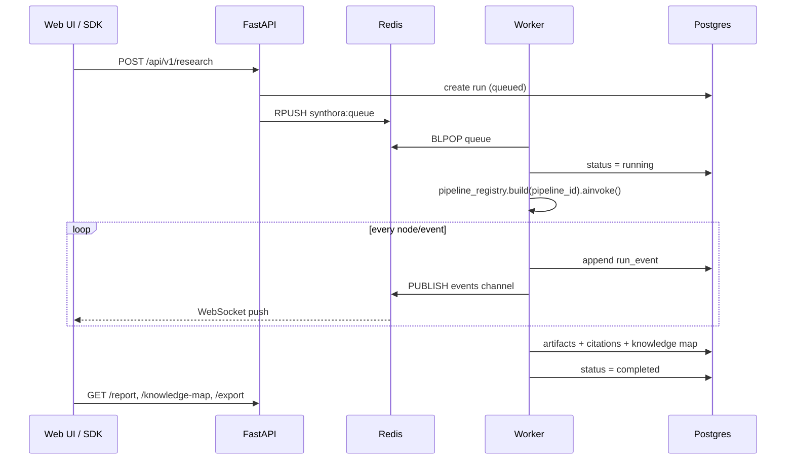

# Synthora architecture

Synthora is organized as four layers with strict dependency direction
(platform → orchestration → intelligence → adapters → core).

## Layers

### Core (`packages/core`)

Domain models (`ResearchRun`, `RunConfig`, `Citation`, `KnowledgeNode`,
`DiscourseTurn`, `OutlineNode`, `Artifact`), progress events, and the ports
every adapter implements (`ChatModel`, `SearchEngine`, `SearchStrategy`,
`RunRepository`, `JobQueue`). No I/O dependencies.

### Adapters (`packages/adapters`)

Named registries resolve providers at runtime — nothing upstream imports a
concrete provider:

- `llm_registry` — `provider:model` strings (`openai:gpt-4o`, `ollama:llama3.1`).
  OpenAI-compatible endpoints cover OpenRouter/vLLM/LM Studio/llama.cpp.
  Think-tags from reasoning models are stripped.
- `search_engine_registry` — full catalog including `searxng`, `tavily`,
  `arxiv`, `semantic_scholar`, `duckduckgo`/`ddg`, `brave`, `serper`,
  `google_pse`, `bing`, `exa`, `guardian`, `wikipedia`, `pubmed`, `openalex`,
  `stackexchange`, `github`, `elasticsearch`, `wayback`, `collection`,
  `serpapi`, `mojeek`, `gutenberg`, `none`/`null`, plus news-oriented engines.
  Key-required engines resolve credentials via workspace provider settings
  (`_env` / `resolve_credential`) and are filtered as unusable when missing.
- `strategy_registry` — `source_based`, `focused_iteration`, and additional
  registered strategies (see `/api/v1/providers` at runtime).
- `embedding_registry` / `resolve_default_embeddings` — OpenAI → Ollama →
  deterministic hash; used by document RAG and research-loop similarity.
- `page_fetch` — SSRF-safe HTTP(S) page text extraction for thin snippets.
- MCP — REST shim at `/api/v1/mcp/tools/*` plus streamable HTTP at `/mcp`.

### Intelligence (`packages/intelligence`)

STORM/Co-STORM knowledge formation as reusable components:

- `PerspectiveEngine` — expert persona discovery + perspective-guided questions.
- `DiscourseManager` — expert/moderator roundtable with turn policy; the
  moderator surfaces *unused* evidence ranked by
  `sim(info, topic)^α · (1 − sim(info, discussion))^(1−α)`.
- `KnowledgeMap` — hierarchical concept map with `insert` (similarity
  placement) and `reorganize` (LLM clustering when a node exceeds capacity).
- `OutlineBuilder` / `SectionWriter` — outline-first, section-wise cited
  writing plus a polish pass.

### Orchestration (`packages/orchestration`)

LangGraph is the only orchestrator. Three nested graphs mirror Open Deep
Research: the top-level pipeline (`AgentState`), the supervisor loop
(`SupervisorState`) with `conduct_research` / `think` / `research_complete`
decisions, and isolated researcher ReAct loops (`ResearcherState`) that
compress findings before returning. The `pipeline_registry` maps pipeline ids
to compiled graphs; `studio.py` exposes them to `langgraph dev`.

A `ResearchContext` (resolved models per role, engines, strategy, event sink,
steering buffer) travels through `config["configurable"]["synthora_ctx"]`, so
nodes stay pure functions of state + context.

### Platform (`apps/api`, `apps/worker`, `packages/persistence`, `packages/sdk`)

- FastAPI gateway: REST + WebSocket, optional auth (`AUTH_MODE=none|session`).
- Redis list queue + pub/sub events; cancellation flags and steering lists.
- Worker consumes the queue with a concurrency cap and executes pipelines via
  `RunExecutor`, persisting artifacts/citations/knowledge maps and mirroring
  every progress event to Postgres (replay) and Redis (live).
- SQLAlchemy async models with Alembic migrations.
- `SynthoraClient` Python SDK mirrors the REST API.

## Data flow for one run

Cancellation: the API sets `synthora:cancel:{run_id}`; the worker's event sink
checks it on every event boundary and aborts. Steering: the API pushes to
`synthora:steer:{run_id}`; the sink drains it into `ctx.steering`, which the
brief and discourse nodes read (the discourse manager injects user turns).
